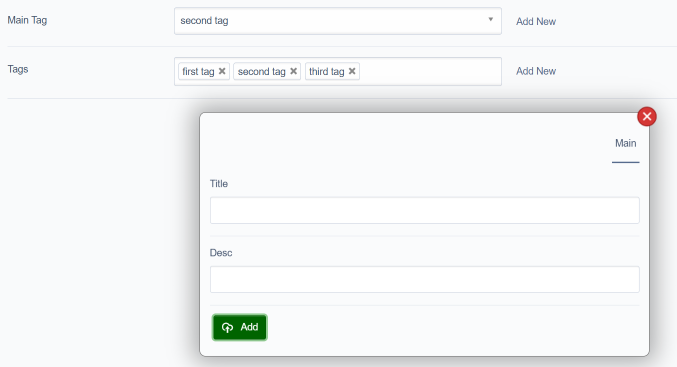

silverstripe-quickaddnew
============================

What is it?
--------

A decorator for form fields that manage object relationships, to allow adding a new object on the fly through a dialog window. It can handle `has_one`,`has_many` or `many_many` relationships. At the moment it has been tested / works on `DropdownField`, `ListboxField` and `CheckboxSetField`. It works both in the CMS and in the frontend.



Requirements
--------

SilverStripe 4/5

For SilverStripe, check branch 1.1

Usage
--------

Firstly, when creating the form field, we need to create a closure that returns the source array to populate the field's options.
We do this because later on, when the field is refreshed with the newly created Object ID as it's value, we need to use this function
Again to get up to date data for the source.

```php
$source = function(){
    return MyObject::get()->map()->toArray();
};
```

Then we can create the form field, calling the closure as the source argument

```php
$field = DropdownField::create('MyObjectID', 'My Object', $source());
// or...
$field = ListboxField::create('MyObjects', 'My Objects', $source());
// or...
$field = CheckboxSetField::create('MyObjects', 'My Objects', $source());
```

Next, we can tell the field to use and configure quickaddnew. The first parameter is the class name of the object that will be created. The second is the $source closure  Note: See QuickAddNewExtension::useAddNew() for the list of configurations parameters available. These allow you to customise the fields and required fields (for validation) for the dialog. By default the object class's getAddNewFields() or getCMSFields() methods are used

```php
$field->useAddNew('MyObject', $source);
```

Add the field to your FieldList

```php
$fields->addFieldToTab('Root.Main', $field);
```

Advanced usage
--------

By default, the dialog will display all fields from `getCMSFields`. You may
want to implement a `getAddNewFields` that returns only a specific set of fields to display
in the creation dialog.
